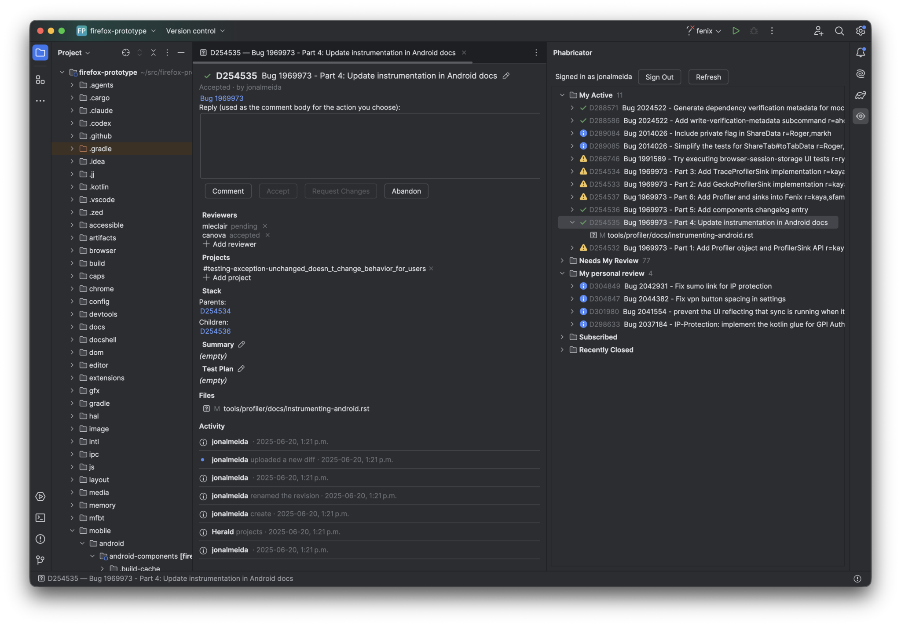

# phabricator-review-intellij

JetBrains IDE plugin for browsing and reviewing [Mozilla Phabricator](https://phabricator.services.mozilla.com/) differential revisions inside IntelliJ IDEA, Android Studio, and other IntelliJ-Platform IDEs. Port of [phabricator-review-vscode](https://github.com/fchasen/phabricator-review-vscode).



## Features

- **Revisions tool window** — five categories (My Active / Needs My Review / My personal review / Subscribed / Recently Closed), live-polled, native speed-search, theme-aware tool-window icon.
- **Diff viewer** — open any changeset in IntelliJ's native diff viewer, with inline-comment threads rendered as gutter icons. Reply to a thread, post a new one, publish your drafts.
- **Revision overview tab** — per-revision editor tab with header, metadata (reviewers, projects, stack, summary, test plan, bug link), files list, and activity timeline.
- **Review actions** — Comment, Accept, Request Changes, Plan Changes, Request Review, Commandeer, Resign, Reclaim, Reopen, Abandon. Buttons appear conditionally on viewer role + revision status (matches the Phabricator web UI).
- **Editable metadata** — title, summary, test plan via a modal dialog; reviewers and projects via a search-as-you-type picker. Click a chip's `×` to remove.
- **Right-click context menu** — Copy Differential ID (`D12345`) and Copy Bug ID (`Bug 1234567`) from any row in the revisions tree.

## Future work

- (Undecided) Submit-from-commit / Git4Idea integration (creating a new revision from a Git commit).
- Mozilla testing-tag picker.
- Searchfox path / symbol picker in the comment composer.
- (Undecided) Reviewer blocking-flag toggle.
- Create new comments at a line number

## Install

The plugin is not published to the JetBrains Marketplace. To install the latest build:

1. `./gradlew buildPlugin` → produces `build/distributions/phabricator-review-intellij-<version>.zip`.
2. In your IDE: **Settings → Plugins → ⚙ → Install Plugin from Disk…** → pick the zip → **Restart**.
3. After restart, open **Settings → Tools → Mozilla Phabricator** and paste your Conduit API token (see below).

## Build

```bash
./gradlew buildPlugin    # produces build/distributions/*.zip
./gradlew runIde         # launches a sandbox IntelliJ Community with the plugin loaded
./gradlew test           # JUnit 5 unit tests (excludes the `live` tag)
./gradlew liveTest       # integration tests against real Phabricator (see below)
./gradlew verifyPlugin   # plugin verifier against recommended IDE versions
```

If you have an IDE already running on the host, `buildPlugin`'s `buildSearchableOptions` task can fail (the task spins up a headless IDE that collides with the active instance). Skip it:

```bash
./gradlew buildPlugin -x buildSearchableOptions
```

Gradle auto-provisions JDK 21 via toolchains — no need to install it yourself.

## Phabricator token

`./gradlew liveTest` and several manual end-to-end test steps read a Conduit API token from a file at the repo root named `.phabricator_token`. **This file is gitignored — never commit it.**

Get a token at <https://phabricator.services.mozilla.com/conduit/login/> and save it:

```bash
echo "api-xxxxxxxxxxxxxxxxxxxxxxxxxx" > .phabricator_token
```

If the file is missing, `liveTest` skips its tests via JUnit's `assumeTrue`.

## Target platform

- Compiled against IntelliJ Platform 2024.3 (build 243) with Kotlin 2.0 and Java 21.
- Advertised compatibility range is open-ended (`since-build=243`, no `until-build`) so the same zip installs into IntelliJ IDEA, Android Studio AI-243 and later (AI-261, AI-270, …), and any future Platform release.

## License

MPL-2.0. See the `LICENSE` file in the source tree.
